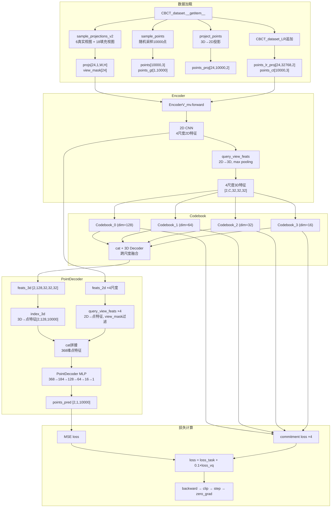
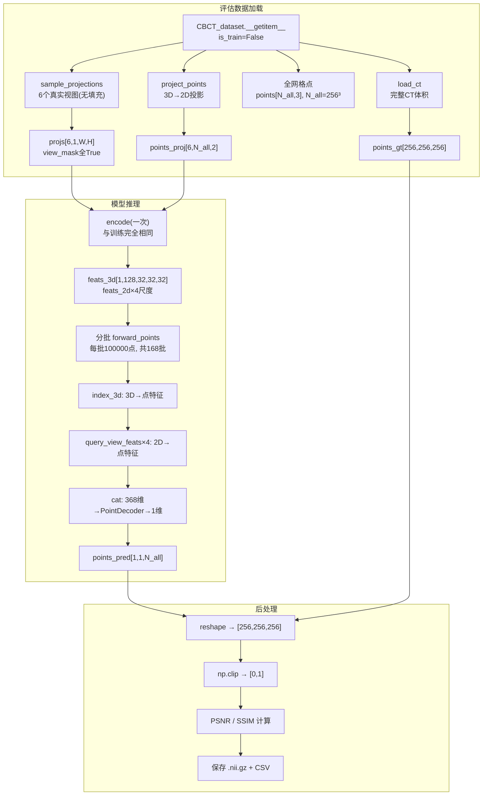

# DeepSparse 模型运行全流程

> 基于 `launch.json` 调试配置：`--cfg_path ./configs/finetune_s1.yaml --dst_name thorax --num_views 24 --min_views 6 --random_views --batch_size 2 --resume 0 --name thorax+6v+s1 --vq_w 0.1`

---

## 阶段一：初始化（`train.py` 的 `__main__`）

### 1. 解析命令行参数
解析 `ArgumentParser`，得到 `args` 对象。

### 2. 加载配置文件
调用 `load_config(args.cfg_path)` 加载 `configs/finetune_s1.yaml`，得到 `cfg`（EasyDict）。

关键配置项：
- `model.encoder`: `encoder_type=base`, `base_ch=16`, `n_layer=3`, `ch_up=2`
- `model.decoder`: `out_ch=128`, `n_conv3d=2`
- `model.point_decoder.mlp_chs`: `[128, 64, 16, 1]`
- `model.codebook.n_embed`: `512`
- `dataset.name`: `dst_lr.CBCT_dataset_LR`
- `dataset.lr_res`: `32`
- `dataset.sampling_method`: `v2`

### 3. 创建数据集
通过 `importlib` 动态导入 `CBCT_dataset_LR`（`datasets/dst_lr.py`），实例化 `train_dst`：

- `CBCT_dataset_LR.__init__` 调用父类 `CBCT_dataset.__init__`（`datasets/base.py`）：
  - 读取 `meta_info.json` 获取样本列表
  - 读取数据集 config 获得分辨率和投影几何 `Geometry_nonuniform`
  - 准备训练用的 block 坐标
- 子类中生成 `points_lr`（`32×32×32` 的低分辨率网格点，归一化到 `[0,1]`）

### 4. 创建 DataLoader
`DataLoader(train_dst, batch_size=2, shuffle=True, num_workers=2, pin_memory=True)`。

### 5. 创建模型
通过 `importlib` 动态导入 `Model_mv`（`models/model_v7.py`），实例化 `model`：

| 组件 | 类 | 数量 | 说明 |
|------|-----|------|------|
| Encoder | `EncoderV_mv` | 1 | 2D 多视角编码器 |
| Codebook | `WrappedEMAVQ3d` | 4 | 每尺度一个，dim 分别为 128/64/32/16 |
| Decoder | `StackedResConv` | 4 | 3D 残差卷积解码器 |
| PointDecoder | `PointDecoder` | 1 | 点预测 MLP |

`PointDecoder` 通道结构：`[368, 184, 128, 64, 16, 1]`，其中 `368 = out_ch(128) + sum(chs)(128+64+32+16)`。

从 `ep_0.pth` 恢复权重（如果存在）。

### 6. 初始化优化器和损失函数
- 优化器：`AdamW(lr=1e-4, weight_decay=1e-3)`
- 损失函数：`MSELoss`

---

## 阶段二：每个 batch 的数据加载

### 7. `CBCT_dataset_LR.__getitem__(index)`

#### ① 父类 `CBCT_dataset.__getitem__`

**采样投影** → `sample_projections(name)`：
- 进入 v2 分支 → `sample_projections_v2(name, n=6, max_views=24)`
- 从 pickle 加载该样本的所有投影 `projs` 和 `angles`
- 先选 6 个真实视角（`view_mask[:6]=True`）
- 再补齐 18 个冗余视角（`view_mask[6:]=False`）
- `random_views=True` 时带随机偏移
- 对 `projs` 做归一化（`/255`）+ 反归一化（`*projs_max/0.2`）

```
返回值：projs [24, 1, W, H], angles [24], view_mask [24]
```

**采样训练点** → `sample_points`：
- 随机选一个 block，加载 block 体素值
- 从 block 坐标中随机采样 10000 个点

```
返回值：points [10000, 3], points_gt [1, 10000]
```

**投影点坐标** → `project_points(points, angles)`：
- 将每个 3D 点投影到每个视角的 2D 图像平面
- 使用 `Geometry_nonuniform.project()`

```
返回值：points_proj [24, 10000, 2]
```

**组装返回**：
```python
data_dict = {
    'dst_name': str,        # 数据集名称，如 'thorax'
    'name': str,            # 样本标识符
    'view_mask': [24],      # 视角有效掩码，前6个True后18个False
    'angles': [24],         # 投影角度
    'projs': [24, 1, W, H], # 投影图像
    'points': [10000, 3],   # 采样点3D坐标
    'points_gt': [1, 10000],# 采样点真实体素值
    'points_proj': [24, 10000, 2], # 采样点在每个视角的投影坐标
}
```

#### ② 子类 `CBCT_dataset_LR.__getitem__` 追加

- `points_lr_proj`：用 `self.points_lr`（32768 个低分辨率网格点）调用 `project_points` → `[24, 32768, 2]`
- `points_ct`：当前 batch 的 points 归一化到 `[-1, 1]` → `[10000, 3]`

**最终 `data_dict` 包含 10 个键**：
```
dst_name, name, view_mask [24], angles [24], projs [24,1,W,H],
points [10000,3], points_gt [1,10000], points_proj [24,10000,2],
points_lr_proj [24,32768,2], points_ct [10000,3]
```

### 8. 批次堆叠
DataLoader 将 2 个样本沿 batch 维度堆叠，所有张量第 0 维变为 `batch_size=2`。

---

## 阶段三：模型前向传播（`model(item)`）

### 9. 入口：`Model_mv.forward(data, is_eval=False)`

```
model(item) → Model_mv.forward()
  ├── self.encode(data)
  │     ├── self.encoder(data, require_2d=True)   [EncoderV_mv]
  │     └── 循环4个尺度: codebook → cat → decoder
  └── self.forward_points(feats_dict, data)
        ├── index_3d: 3D特征 → 点特征
        ├── query_view_feats ×4: 2D特征 → 点特征 (view_mask过滤)
        ├── cat拼接
        └── point_decoder MLP
```

---

### 10. EncoderV_mv.forward(data, require_2d=True)

#### 10a. 提取投影图像
```python
x = data['projs']  # [B, M, 1, W, H] = [2, 24, 1, 128, 128]
x = x.reshape(b*m, 1, W, H)  # [48, 1, 128, 128]
```

#### 10b. 2D 编码器提取多尺度特征
`self.encoder(x)`（`Encoder_base`，2D CNN with 3层 + 初始层）：

| 尺度 | shape | 通道数 |
|------|-------|--------|
| 0 | `[48, 128, 32, 32]` | 128 |
| 1 | `[48, 64, 64, 64]` | 64 |
| 2 | `[48, 32, 128, 128]` | 32 |
| 3 | `[48, 16, 256, 256]` | 16 |

#### 10c. 2D 特征 → 3D 特征
每个尺度：
- reshape 为 `[B, M, C, H, W]`
- 调用 `query_view_feats(view_feats, points_proj=data['points_lr_proj'], fusion='max')`：
  - 对 24 个视角分别调用 `index_2d`（`grid_sample` 按投影坐标双线性插值采样）
  - stack 为 `[B, C, 32768, 24]`
  - max pooling 跨视角 → `[B, C, 32768]`
  - reshape 为 `[B, C, 32, 32, 32]`

**输出**：

| 尺度 | 3D 特征 shape |
|------|---------------|
| feats_3d[0] | `[2, 128, 32, 32, 32]` |
| feats_3d[1] | `[2, 64, 32, 32, 32]` |
| feats_3d[2] | `[2, 32, 32, 32, 32]` |
| feats_3d[3] | `[2, 16, 32, 32, 32]` |

同时保留 `feats_2d` 列表（4 个尺度的 2D 特征）。

---

### 11. Codebook 量化（`encode` 循环中）

对每个尺度 i=0,1,2,3：

#### 11a. 进入 WrappedEMAVQ3d
```python
feats, loss_vq = self.cb[i](feats)
```

1. **pre_quant**：`Conv3d(dim, dim, 1)` — 线性变换
2. **EMAVectorQuantizer.forward**：
   - 输入 `[B, C, 32, 32, 32]` → 展平为 `[65536, C]`
   - 计算与 512 个 codebook 向量的平方距离：$d_{ij} = \|z_i\|^2 + \|e_j\|^2 - 2 z_i \cdot e_j$
   - `argmin` 选最近索引 → `encoding_indices [65536]`
   - 查表得到量化向量 → `z_q [65536, C]`
   - 计算 perplexity（衡量 codebook 使用均匀度）
   - commitment loss：`β × MSE(z_q.detach(), z)`
   - STE 直通梯度：`z_q = z + (z_q - z).detach()`
   - EMA 更新 codebook：更新 `cluster_size`、`embed_avg`，然后 `weight = embed_avg / cluster_size`
3. **post_quant**：`Conv3d(dim, dim, 1)` — 特征恢复

**4 个 codebook 对照表**：

| 尺度 | 2D 特征通道 | 3D 特征通道 | Codebook dim | n_embed |
|------|-----------|-----------|-------------|---------|
| 0 | 128 | 128 | 128 | 512 |
| 1 | 64 | 64 | 64 | 512 |
| 2 | 32 | 32 | 32 | 512 |
| 3 | 16 | 16 | 16 | 512 |

> **注意**：Codebook 作用于的是 3D 特征（从 2D 转换后），而非直接作用于 2D 特征。每个尺度的 codebook 参数独立，`embedding_dim` 不同但 `n_embed=512` 相同。

#### 11b. 跨尺度融合
```python
if i > 0:
    feats = torch.cat([feats, feats_out], dim=1)  # 通道维拼接
feats_out = self.decoders[i](feats)               # 3D 残差卷积，输出 [2, 128, 32, 32, 32]
```

| i | 拼接后通道 | decoder 输入通道 |
|---|-----------|-----------------|
| 0 | 128（不拼） | 128 |
| 1 | 64 + 128 = 192 | 192 |
| 2 | 32 + 128 = 160 | 160 |
| 3 | 16 + 128 = 144 | 144 |

---

### 12. encode 返回

```python
feats_dict = {
    'feats_2d': [4个尺度的2D特征],  # [2,24,128,32,32] → [2,24,16,256,256]
    'feats_3d': feats_out,          # [2, 128, 32, 32, 32]
    'loss_vq': 4层codebook的平均commitment loss
}
```

---

### 13. forward_points(feats_dict, data)

#### 13a. 3D 特征采样
```python
p_feats = index_3d(feats_3d, data['points_ct'])  # [2, 128, 10000]
```
通过 `grid_sample` 从 `[2,128,32,32,32]` 中按 `points_ct`（归一化到 `[-1,1]`）采样 10000 个点。

#### 13b. 多尺度 2D 特征采样与拼接
对 4 个尺度循环：
```python
p_feats_2d = query_view_feats(
    view_feats=feats_2d[i],
    points_proj=data['points_proj'],
    fusion='max',
    view_mask=data['view_mask']    # 屏蔽填充视图
)
p_feats = torch.cat([p_feats_2d, p_feats], dim=1)
```

| 迭代 | p_feats_2d 通道 | 拼接后总通道 |
|------|----------------|-------------|
| 初始 | — | 128 |
| i=0 | 128 | 256 |
| i=1 | 64 | 320 |
| i=2 | 32 | 352 |
| i=3 | 16 | **368** |

**368 的构成**：`out_ch(128) + sum(chs)(128+64+32+16)`

#### 13c. PointDecoder MLP
`p_pred = self.point_decoder(p_feats)` → `[2, 1, 10000]`

**拼接式残差连接**（每层都将原始 368 维输入拼接到当前特征）：

| 层 | Conv1d 参数 | 拼接后输入 | 输出 |
|----|------------|-----------|------|
| 0 | `(368, 184)` | 368 | 184 |
| 1 | `(552, 128)` | 184+368=552 | 128 |
| 2 | `(496, 64)` | 128+368=496 | 64 |
| 3 | `(432, 16)` | 64+368=432 | 16 |
| 4 | `(384, 1)` | 16+368=384 | 1 |

---

### 14. forward 返回

```python
{
    'points_pred': [2, 1, 10000],  # 预测体素值
    'loss_vq': float                # codebook 量化损失
}
```

---

## 阶段四：损失计算与反向传播

### 15. 损失计算
```python
loss_task = MSE(points_pred, points_gt)         # 体素值回归损失
loss_vq = pred.get('loss_vq', 0)                # codebook commitment loss
loss = loss_task + 0.1 * loss_vq                # 总损失
```

### 16. 反向传播
```python
loss.backward()                                 # 梯度反向传播
```
- 梯度通过 STE（Straight-Through Estimator）直通 codebook 量化层
- `z_q = z + (z_q - z).detach()` 确保前向用量化值、反向梯度直接传回 encoder

### 17. 参数更新
```python
clip_grad_norm_(model.parameters(), 1.0)        # 梯度裁剪，防止梯度爆炸
optimizer.step()                                 # AdamW 更新参数
optimizer.zero_grad()                            # 梯度清零
```

---

## 完整数据流图



---

## 关键数据结构速查

| 张量名 | shape | 含义 |
|--------|-------|------|
| `projs` | `[B, M, 1, W, H]` | 多视角投影图像 |
| `view_mask` | `[B, M]` | 视角有效掩码（前 min_views 为 True） |
| `angles` | `[B, M]` | 投影角度 |
| `points` | `[B, N, 3]` | 采样点 3D 坐标（训练用，~[0,1]） |
| `points_gt` | `[B, 1, N]` | 采样点真实体素值 |
| `points_proj` | `[B, M, N, 2]` | 训练点在每个视角的 2D 投影坐标 |
| `points_lr_proj` | `[B, M, 32768, 2]` | 低分辨率网格点（32³）在每个视角的投影坐标 |
| `points_ct` | `[B, N, 3]` | 采样点归一化坐标（`[-1, 1]`），用于 `index_3d` |
| `feats_3d[i]` | `[B, C_i, 32, 32, 32]` | 第 i 尺度 3D 特征（C₀=128, C₁=64, C₂=32, C₃=16） |
| `feats_2d[i]` | `[B, M, C_i, H_i, W_i]` | 第 i 尺度 2D 特征 |
| `feats_out` | `[B, 128, 32, 32, 32]` | Decoder 融合后的 3D 特征 |
| `p_feats` | `[B, 368, N]` | 拼接后的点特征（3D + 4×2D） |
| `points_pred` | `[B, 1, N]` | 预测体素值 |

---

---

# 评估/推理流程

> 基于 `scripts/evaluate_s2.sh`：`--name thorax+6v+s1 --epoch 400 --dst_name thorax --split test --num_views 6 --out_res_scale 1.0 --test_time --save_results`

---

## 训练 vs 评估总对比

| 维度 | 训练 | 评估 |
|------|------|------|
| **入口脚本** | `code/train.py` | `code/evaluate.py` |
| **数据采样** | 随机 block 中 10000 点 | 全网格所有点（256³ ≈ 16.8M 点） |
| **视图数量** | 6 真实 + 18 填充 = 24 | 6 真实（无填充） |
| **view_mask** | `[T×6, F×18]` | `[T×6]` |
| **random_views** | `True`（随机偏移） | `False`（`view_offset=0`，固定） |
| **batch_size** | 2 | 1 |
| **model(is_eval=)** | `False` | `True` |
| **forward_points 调用** | 1 次（10000 点） | 多次分批（每批 100000 点） |
| **目标函数** | MSE + 0.1×VQ loss | 无 loss，只推理 |
| **梯度** | 有，更新参数 | `torch.no_grad()` |
| **输出** | `points_pred [B,1,10000]` | `points_pred [1,1,N_all]` → reshape 为 3D 体积 |
| **评价指标** | loss 数值 | PSNR / SSIM |
| **保存** | checkpoint `.pth` | `.nii.gz` + CSV |

> **关于 N_all**：Thorax Fast 数据集的分辨率是 `[256, 256, 256]`，因此 `N_all = 256³ = 16,777,216 ≈ 16.8M` 个点。这是评估时需要预测的全网格点总数。

---

## 阶段一：入口与初始化（`evaluate.py` 的 `__main__`）

### 1. 解析命令行参数
```bash
CUDA_VISIBLE_DEVICES=0 python code/evaluate.py \
    --name thorax+6v+s1 \       # 实验名称，对应 ./logs/ 下的日志目录
    --epoch 400 \               # 加载 ep_400.pth
    --dst_name thorax \         # 数据集名称
    --split test \              # 使用 test 划分
    --num_views 6 \             # 视角数（无填充）
    --out_res_scale 1.0 \       # 全分辨率评估
    --test_time \               # 记录推理时间
    --save_results              # 保存 .nii.gz 预测结果
```

### 2. 加载配置
从 `./logs/thorax+6v+s1/config.yaml` 加载配置（与训练时相同）。

### 3. 创建评估 DataLoader
```python
DST_CLASS(
    dst_name='thorax',
    cfg=cfg.dataset,
    split='test',           # ← 不是 'train'
    num_views=6,            # ← 评估时只取 6 个视角，无填充
    out_res_scale=1.0,      # ← 全分辨率
    view_offset=0,          # ← 固定视角，不随机
)
```
关键设置：`batch_size=1, shuffle=False`。

### 4. 加载模型
```python
ckpt = torch.load('./logs/thorax+6v+s1/ep_400.pth')
model = METHOD_CLASS(cfg.model)
model.load_state_dict(ckpt)
model = model.cuda()
model.eval()  # 在 eval_one_epoch 中调用
```
**不调 `model.freeze_ft()`**，因为不需要梯度更新。

---

## 阶段二：数据加载（评估模式的关键差异）

### 5. `CBCT_dataset.__getitem__`（`is_train=False`）

```python
# -- 加载投影（评估模式下 num_views=6，无填充，view_mask 全 True）
projs, angles, view_mask = self.sample_projections(name)
# 此时 n_views == max_views，不进入 v2 填充分支
# view_mask = [True, True, True, True, True, True]

# -- 加载采样点（评估模式：全网格！）
if not self.is_train:
    points = self.points          # 256³ 的所有坐标 [N_all, 3]
    points_gt, spacing, origin = self.load_ct(name)
    # points_gt 形状：[256, 256, 256]，完整 3D CT 体积

# -- 投影坐标（首次计算后缓存，后续样本复用）
if self.is_train or self.points_proj is None:
    points_proj = self.project_points(points, angles)
    self.points_proj = points_proj  # 缓存
```

**评估 vs 训练数据加载对比**：

| 字段 | 训练 | 评估 |
|------|------|------|
| `projs` 视角数 | 24 (6真实+18填充) | 6 (全部真实) |
| `view_mask` | `[T×6, F×18]` | `[T×6]` |
| `points` | `[10000, 3]` 随机采样 | `[N_all, 3]` 全网格 (256³) |
| `points_gt` | `[1, 10000]` 标量 | `[256, 256, 256]` 完整CT |
| `points_proj` | `[24, 10000, 2]` | `[6, N_all, 2]` |
| `angles` | `[24]` | `[6]` |
| `random_views` | True | False |
| `spacing`/`origin` | 无 | 有（用于保存 .nii.gz） |

---

## 阶段三：模型推理（`model(item, is_eval=True)`）

### 6. `Model_mv.forward(data, is_eval=True, eval_npoint=100000)`

```
model(item, is_eval=True, eval_npoint=100000)
  │
  ├── feats_dict = self.encode(data)   ← 只调用一次！
  │     └── 与训练完全相同：
  │           EncoderV_mv → 4尺度3D特征 → codebook×4 → cat+decoder融合
  │           返回 {feats_2d, feats_3d, loss_vq}
  │
  └── 分批推理（因为 N_all=16.8M 太大，一次放不进 GPU）：
        total_npoint = data['points_ct'].shape[1]  # 16.8M
        n_batch = ceil(16.8M / 100000) ≈ 168 批
        
        for i in range(n_batch):
            # 切片：取第 i 批的 100000 个点
            left = i * 100000
            right = min((i+1)*100000, total_npoint)
            
            # 只切片与点相关的 key
            tmp_data = {}
            for key in data.keys():
                if key in self.registered_point_keys:  # ['points_proj', 'points_ct']
                    tmp_data[key] = data[key][..., left:right, :]
                else:
                    tmp_data[key] = data[key]  # view_mask, projs 等不变
            
            points_pred = self.forward_points(feats_dict, tmp_data)
            pred_list.append(points_pred)
        
        return {'points_pred': torch.cat(pred_list, dim=2)}
```

**关键设计**：
- `encode` 只调用 **1 次**，因为 3D/2D 特征是共享的
- `forward_points` 调用 **168 次**，每次处理 100000 个点
- `registered_point_keys = ['points_proj', 'points_ct']` 指定哪些 key 需要切片

### 7. `forward_points`（与训练相同，但 view_mask 全 True）

```
p_feats = index_3d(feats_3d, points_ct)        # [1, 128, 100000]
for each 2D feat scale (4个尺度):
    p_feats_2d = query_view_feats(
        view_feats, points_proj, 
        fusion='max', 
        view_mask=data['view_mask']  # 全True，6个视图都参与
    )
    p_feats = cat([p_feats_2d, p_feats])       # 累积拼接
p_pred = point_decoder(p_feats)                # [1, 1, 100000]
```

### 8. 最终输出
```python
{'points_pred': [1, 1, 16800000]}  # 168批×100000 = 16.8M
```

---

## 阶段四：后处理与指标计算（`eval_one_epoch`）

### 9. 提取预测和真值

```python
pred = model(item, is_eval=True, eval_npoint=100000)  # 得到所有点预测

output = pred['points_pred']              # [1, 1, N_all]
output = output[0, 0].cpu().numpy()       # [N_all] = 16.8M 个标量

image = item['points_gt'].cpu().numpy()   # [256, 256, 256] 完整 CT

output = output.reshape(256, 256, 256)    # 重塑为 3D 体积
output = np.clip(output, 0, 1)            # 裁剪到 [0, 1]
```

### 10. 计算 PSNR / SSIM

```python
from skimage.metrics import peak_signal_noise_ratio, structural_similarity

psnr = peak_signal_noise_ratio(image, output, data_range=1.)
ssim = structural_similarity(image, output, data_range=1.)
```

### 11. 保存 NIfTI（可选）

```python
if args.save_results:
    sitk_save(
        f'{name}.nii.gz',               # 样本名.nii.gz
        output,                          # 预测的 3D 体积
        spacing=item['spacing'],         # 体素间距 [2.0, 2.0, 2.0] mm
        origin=item['origin'],           # 物理坐标原点
        uint8=True                       # 转为 uint8 保存
    )
```

### 12. 汇总并写入 CSV

```python
# 所有样本跑完后，计算平均 PSNR/SSIM
for dst_name in metrics.keys():
    metrics[dst_name] = {
        'psnr': np.mean(所有样本PSNR),
        'ssim': np.mean(所有样本SSIM)
    }

# 写入 CSV：./logs/thorax+6v+s1/results/ep_400/results_1.0x.csv
csv_writer.writerow(['dataset', 'obj_id', 'psnr', 'ssim'])
for 每个样本:
    csv_writer.writerow([dst_name, name, psnr, ssim])
csv_writer.writerow([dst_name, 'average', 平均PSNR, 平均SSIM])
```

---

## 评估数据流图


