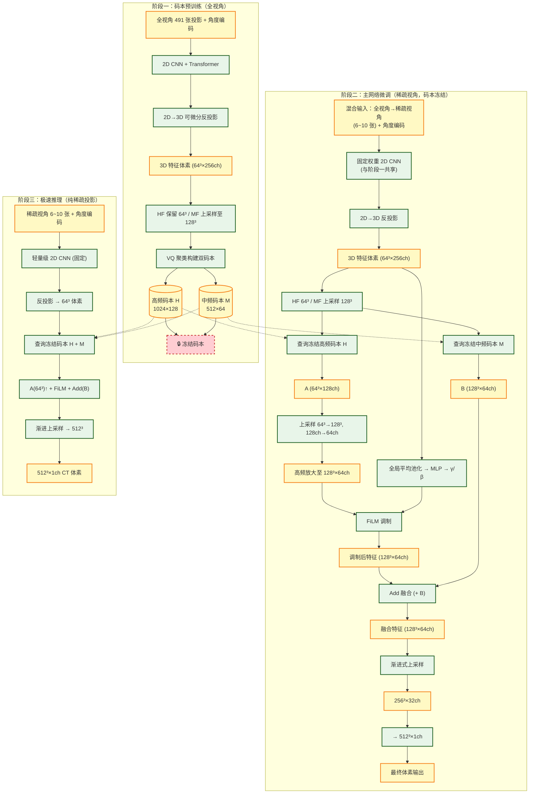

# SparseViewReconstruction 模型文档

基于双码本先验 + FiLM 骨架调制 + 渐进式 Mask 课程学习的稀疏 CBCT 重建。

**核心目标**：从 6~10 张稀疏 X 射线投影重建 CT 体素——**解剖结构对齐 CBCT，HU 值分布对齐 pCT**。

----

## 整体架构概览



### 三阶段总览

| 阶段 | 输入视角 | 码本状态 | 编码器状态 | 训练目标 |
|------|---------|---------|-----------|---------|
| 阶段一 (epoch 1~N₁) | 全视角 (491) | **可学习** | 可学习 | 构建高质量解剖码本 |
| 阶段二 (epoch N₁+1~N) | 渐进 Mask: 全→稀疏 (6) | **🔒冻结** | 可学习 | 适应稀疏输入，微调解码器 |
| 阶段三 (推理) | 稀疏 (6~10) | **🔒冻结** | **🔒冻结** | 纯前向快速重建 |

----

## 损失函数

三个损失各司其职，精确控制输出的解剖结构和 HU 值分布：

```python
L_total = 1.0 × L_lap  +  0.3 × L_struct  +  0.1 × L_vq
```

### 1. L_lap — 拉普拉斯金字塔损失（权重 1.0，主导）

| 项目 | 说明 |
|------|------|
| **公式** | `Σᵢ ‖Pred_levelᵢ − pCT_levelᵢ‖₁` |
| **比对对象** | **pCT**（规划 CT） |
| **作用维度** | 🎨 **HU 值分布风格** |
| **机制** | 将 pred 和 pCT 分别做拉普拉斯金字塔分解（levels=2），逐级计算 L1 |

```
拉普拉斯金字塔:
  Level 0 (高频细节): residual = img − upsample(downsample(img))
                       ↓ 捕获纹理、边缘的 HU 精度
  Level 1 (中频骨架): downsample(img)
                       ↓ 捕获整体亮度、窗宽窗位、组织对比度
```

> **为什么用拉普拉斯金字塔而不是直接 L2？** 直接 L2 会把高频细节和低频骨架混在一起模糊掉。金字塔分解后 HF 比 HF、MF 比 MF，形成**闭环频域监督**，确保解码器输出的高频码本特征和 pCT 的高频分量对齐。

### 2. L_struct — 结构损失（权重 0.3，辅助）

| 项目 | 说明 |
|------|------|
| **公式** | `‖∇Pred − ∇CBCT‖₁`（三方向梯度 L1 差） |
| **比对对象** | **CBCT**（锥束 CT 全重建） |
| **作用维度** | 🦴 **解剖结构 / 边缘形状** |
| **机制** | 只比较空间梯度，不比较绝对 HU 值 |

```
梯度计算:  ∂Pred/∂x − ∂CBCT/∂x  (同理 ∂y, ∂z)
          ↓ 只看变化量，不看绝对值
CBCT 优势: 器官边界清晰（不受锥束伪影影响边缘位置）
CBCT 劣势: HU 值不准（散射、硬化伪影） → L_struct 不惩罚 HU 差异！
```

> **为什么对 CBCT 只算梯度？** CBCT 的 HU 值被锥束伪影污染，但**边缘位置是准确的**。梯度 L1 只关心"边界在哪里"，不关心"边界处的 HU 值是多少"。

### 3. L_vq — 码本损失（权重 0.1，正则）

| 项目 | 说明 |
|------|------|
| **公式** | `‖sg[Q]−C‖² + 0.25×‖Q−sg[C]‖²` |
| **作用** | 📚 码本学习，确保解剖原语被充分利用 |
| **说明** | 双码本各有一个 VQ 损失，最终求和 |

```
sg[·] = stop_gradient（阻止梯度回传）

码本损失:   让码本向量 C 靠近编码器输出 Q（更新码本）
承诺损失:   让编码器输出 Q 靠近码本向量 C（更新编码器）
           ×0.25 平衡两者更新速度
```

---

## 损失-目标对照表

| 你想要的效果 | 用什么损失 | 和谁比 | 为什么不和其他比 |
|-------------|-----------|--------|-----------------|
| 🦴 器官形状 = CBCT | `L_struct` (梯度 L1) | CBCT | CBCT 的 HU 不准，但边缘位置对 |
| 🎨 HU 值 = pCT | `L_lap` (金字塔 L1) | pCT | pCT 的 HU 精准，频域分解后逐级对齐 |
| ❌ 不用 MSE 比 CBCT | — | — | MSE 会强迫 HU 值对齐 CBCT，污染输出 |
| ❌ 不用梯度比 pCT | — | — | pCT 和投影间没有直接几何对应关系 |
| 📚 码本利用充分 | `L_vq` | 自身 | 防止码本坍缩（死神经元） |

---

## 关键设计决策

| 决策 | 原因 |
|------|------|
| **阶段一冻结码本** | 码本存储通用解剖先验，后续不应被稀疏视角的残缺特征污染 |
| **HF 64³ / MF 128³** | HF 小尺寸存细节纹理，MF 大尺寸存器官轮廓骨架 |
| **先上采样再 FiLM** | 避免特征维度错位导致的伪影 |
| **Add 融合而非 Concat** | 通道数不翻倍，显存减半 |
| **渐进式 Mask（非切换）** | 网络从 Day1 就在学"补全"，避免 Catastrophic Forgetting |
| **3D 全局池化 → FiLM 条件** | 用整体风格向量调制局部特征，比逐像素调制更鲁棒 |

---

## 关键超参数

| 参数 | 值 | 说明 |
|------|-----|------|
| `stage1_epochs` | 100 | 阶段一（码本预训练）持续 epoch 数 |
| `train_views` / `max_views` | 6 / 48 | 最少/最多保留视角数 |
| `target_keep` | 0.012 | 最终保留比例 (~6/491) |
| `n_decoder_ups` | 1→256³, 2→512³ | 解码器上采样次数 |
| `w_lap` / `w_struct` / `w_vq` | 1.0 / 0.3 / 0.1 | 损失权重 |
| LR | 1e-4 | AdamW + CosineAnnealing |
| Batch Size | 1 | 3D 模型显存限制 |
| AMP | True | fp16 混合精度 |

---

## 文件结构

```
LightningRecon/
├── src/
│   ├── models.py      # MultiScaleCNN2D, ViewTransformer, BackProjection3D,
│   │                    Codebook(HF+MF), FiLMBlock3D, ProgressiveDecoder,
│   │                    SparseViewReconstruction (6.3M params)
│   ├── losses.py      # laplacian_pyramid_loss, structural_loss, ReconstructionLoss
│   ├── dataset.py     # PairedCBCTDataset
│   ├── train.py       # 三阶段训练 + 渐进Mask + AMP + checkpoint
│   └── inference.py   # 端到端推理
├── data/thorax_fast/       # → DeepSparse/data/thorax_fast
├── logs/              # 训练日志 + TensorBoard + checkpoint
└── mymodel.md         # 本文档
```

### 命令

```bash
# 训练 (256³ 输出, 8GB 显卡)
python src/train.py --data_root data/thorax_fast --epochs 400 \
    --vol_size 256 256 256 --stage1_epochs 100 --n_decoder_ups 1 --max_views 24

# 训练 (512³ 输出, ≥16GB 显卡)
python src/train.py --data_root data/thorax_fast --epochs 400 \
    --stage1_epochs 100 --n_decoder_ups 2 --max_views 48

# 推理
python src/inference.py \
    --checkpoint logs/thorax_6view/best_model.pth \
    --data_root data/thorax_fast --case_id CASE_ID --n_views 6

# TensorBoard
tensorboard --logdir logs/
```
