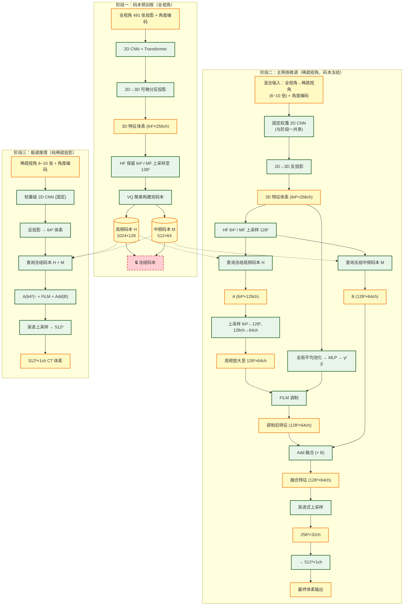

# SparseViewReconstruction 模型文档

基于双码本先验 + FiLM 骨架调制 + 渐进式 Mask 课程学习的稀疏 CBCT 重建。

**核心目标**：从 6~10 张稀疏 X 射线投影重建 CT 体素——**解剖结构和 HU 值分布均对齐 pCT**。

----

## 整体架构概览


```mermaid
graph TD
    classDef pretrain fill:#e1f5fe,stroke:#01579b,stroke-width:2px;
    classDef finetune fill:#f3e5f5,stroke:#4a148c,stroke-width:2px;
    classDef infer fill:#fff3e0,stroke:#e65100,stroke-width:2px;
    classDef module fill:#e8f5e9,stroke:#1b5e20,stroke-width:2px;
    classDef data fill:#fff9c4,stroke:#f57f17,stroke-width:2px;
    classDef frozen fill:#ffcdd2,stroke:#c62828,stroke-width:2px,stroke-dasharray: 5 5;

    subgraph Stage1 [阶段一：码本预训练（全视角）]
        direction TB
        P1["全视角 491 张投影 + 角度编码"]:::data --> P2["2D CNN + Transformer"]:::module
        P2 --> P3["2D→3D 可微分反投影"]:::module
        P3 --> P4["3D 特征体素 (64³×256ch)"]:::data
        P4 --> P5["HF 保留 64³ / MF 上采样至 128³"]:::module
        P5 --> P6["VQ 聚类构建双码本"]:::module
        P6 --> P7[("高频码本 H<br>1024×128")]:::data
        P6 --> P8[("中频码本 M<br>512×64")]:::data
        P7 --> P9["🔒 冻结码本"]:::frozen
        P8 --> P9
    end

    subgraph Stage2 [阶段二：主网络微调（稀疏视角，码本冻结）]
        direction TB
        F1["混合输入：全视角→稀疏视角<br>(6~10 张) + 角度编码"]:::data --> F2["固定权重 2D CNN<br>(与阶段一共享)"]:::module
        F2 --> F3["2D→3D 反投影"]:::module
        F3 --> F4["3D 特征体素 (64³×256ch)"]:::data
        F4 --> F5["HF 64³ / MF 上采样 128³"]:::module

        F5 --> F6["查询冻结高频码本 H"]:::module
        P7 -.-> F6
        F6 --> F7["A (64³×128ch)"]:::data

        F5 --> F8["查询冻结中频码本 M"]:::module
        P8 -.-> F8
        F8 --> F9["B (128³×64ch)"]:::data

        F7 --> F10["上采样 64³→128³, 128ch→64ch"]:::module
        F10 --> F11["高频放大至 128³×64ch"]:::data

        F4 --> F12["全局平均池化 → MLP → γ/β"]:::module
        F11 --> F14["FiLM 调制"]:::module
        F12 --> F14
        F14 --> F15["调制后特征 (128³×64ch)"]:::data

        F15 --> F16["Add 融合 (+ B)"]:::module
        F9 --> F16
        F16 --> F17["融合特征 (128³×64ch)"]:::data

        F17 --> F18["渐进式上采样"]:::module
        F18 --> F19["256³×32ch"]:::data
        F19 --> F20["→ 512³×1ch"]:::module
        F20 --> F21["最终体素输出"]:::data
    end

    subgraph Stage3 [阶段三：极速推理（纯稀疏投影）]
        direction TB
        I1["稀疏视角 6~10 张 + 角度编码"]:::data --> I2["轻量级 2D CNN (固定)"]:::module
        I2 --> I3["反投影 → 64³ 体素"]:::module
        I3 --> I4["查询冻结码本 H + M"]:::module
        P7 -.-> I4
        P8 -.-> I4
        I4 --> I5["A(64³)↑ + FiLM + Add(B)"]:::module
        I5 --> I6["渐进上采样 → 512³"]:::module
        I6 --> I7["512³×1ch CT 体素"]:::data
    end
```

### 三阶段总览 (v4)

| 阶段 | Epoch | 视角 | 码本 | LR | 说明 |
|------|-------|------|------|-----|------|
| 阶段一 | 1~200 | 64 | 🔓 可学习 (1e-4) | encoder=1e-4 | 构建解剖码本 |
| 阶段二 | 201~600 | 56→...→8 (10级) | 🔓 低LR (5e-6) | encoder=5e-5 | 平滑适应稀疏视角 |
| 阶段三 | 601~700 | 6 | 🔒 冻结 (LR=0) | encoder=1e-5, decoder=2e-5 | 终态 6-view 微调 |

**视角衰减**：`--stage2_view_decay "8,4,2"` 自动生成 11 级平滑序列：

| 步长 | 阶段 | 序列 | 每级 epoch |
|------|------|------|-----------|
| 8 | 前期快降 | 64→56→48→40→32→24 | 40 |
| 4 | 中期细调 | 24→20→16→12 | 40 |
| 2 | 后期逼近 | 12→10→8→6 | 40 |

总计：**200 + 10×40 + 100 = 700 epochs**

也可用其他步长组合：`"6,3"` / `"4,2"` / `"8"`，算法自动推断各步长的适用范围。

----

## 损失函数 (v4: Charbonnier 主导)

损失函数从三部分改为四部分，**L_img (Charbonnier) 为主损失**：

```python
L_total = w_img·L_img + w_lap·L_lap + w_struct·L_struct + w_vq·L_vq
```

| 阶段 | w_img | w_lap | w_struct | w_vq | 说明 |
|------|-------|-------|----------|------|------|
| 阶段一 (64 views) | **1.0** | 0.05 | 0.10 | 0.05 | 码本学习，L_img 主导 |
| 阶段二 (56→8 views) | **1.0** | 0.04 | 0.08 | 0.02 | 稀疏适应，码本低LR |
| 阶段三 (6 views) | **1.0** | 0.02 | 0.05 | 0 | 纯微调，码本冻结 |

### 1. L_img — Charbonnier 图像损失（权重 1.0，**主导**）

| 项目 | 说明 |
|------|------|
| **公式** | `√((pred−ct)² + ε²)`, ε=1e-3 |
| **计算区域** | **body mask 内**（仅计算身体区域 HU 误差） |
| **作用** | 直接优化 mask 内 HU 值精度，L1 平滑版本梯度更稳定 |

### 2. L_lap — 拉普拉斯金字塔损失（权重 0.02~0.05，辅助）

金字塔分解后逐级 L1 对齐，形成闭环频域监督。

### 3. L_struct — 结构损失（权重 0.05~0.10，辅助）

三方向梯度 L1 差，对齐解剖边缘。

### 4. L_vq — 码本损失（权重 0~0.05，正则）

---

## 关键设计决策

| 决策 | 原因 |
|------|------|
| **阶段一冻结码本** | 码本存储通用解剖先验，后续不应被稀疏视角的残缺特征污染 |
| **HF 64³ / MF 128³** | HF 小尺寸存细节纹理，MF 大尺寸存器官轮廓骨架 |
| **L_lap + L_struct 都用 CT** | 不再使用 CBCT，CT 同时提供精准 HU 和清晰边缘，双损失互补 |
| **先上采样再 FiLM** | 避免特征维度错位导致的伪影 |
| **Add 融合而非 Concat** | 通道数不翻倍，显存减半 |
| **渐进式 Mask（非切换）** | 网络从 Day1 就在学"补全"，避免 Catastrophic Forgetting |
| **3D 全局池化 → FiLM 条件** | 用整体风格向量调制局部特征，比逐像素调制更鲁棒 |
| **EMA 码本（非梯度码本）** | 梯度码本易坍缩 (SSIM≈0)；EMA 指数移动平均更新码字，避免死神经元 |
| **分块距离计算** | 128³ 体积 × 512 码字 = 4GB 矩阵 → 自动分块 (≤256MB/块)，避免 OOM |

---

## 码本实现：EMA Vector Quantizer

### 为什么不用梯度码本？

原始梯度码本 (`query_codebook_3d`) 使用直通估计器 (STE) 回传梯度：
- **问题**：梯度码本无法保证码字被充分使用 → **码本坍缩**（SSIM≈0，perplexity≈1）
- **表现**：训练 60+ 轮 SSIM 始终为 0，所有编码器输出映射到 1-2 个码字

### EMA 码本原理

```python
# 核心：EMA 更新替代梯度更新
class EmbeddingEMA:
    cluster_size_ema = decay * cluster_size + (1-decay) * sum(one_hot)
    embed_avg_ema    = decay * embed_avg    + (1-decay) * embed_sum
    
    # 拉普拉斯平滑避免除零
    weight = embed_avg_normalized / (cluster_size_smoothed)
    
    # 关键：未使用的码字保持原值（不除以 eps）
    weight[cluster_size == 0] = weight_original
```

| 参数 | 值 | 说明 |
|------|-----|------|
| `decay` | 0.99 | EMA 衰减速率为 0.99，稳定更新 |
| `beta` | 0.25 | commitment loss 权重 |
| `eps` | 1e-5 | 拉普拉斯平滑系数 |
| 距离精度 | fp32 | 强制 float32 计算距离，防止 AMP fp16 溢出 NaN |

### 分块计算：避免 O(N×K) 矩阵 OOM

```
问题：einsum('bd,nd->bn', z, w) 产生的距离矩阵：
  HF 码本：64³ × 1024 = 262K × 1024 = 1.0 GB
  MF 码本：128³ × 512  = 2.1M × 512  = 4.3 GB  ← OOM!

解决：自适应分块
  chunk_size = 256MB / (num_tokens × 4)
  → 将 z 分成多个 chunk，逐块计算 argmin 和 scatter_add
  → 数学等价，峰值内存从 4.3GB 降到 256MB
```

双码本配置：

| 码本 | 体积 | 通道 | 码字数 | 分块数 | 峰值显存 | 用途 |
|------|------|------|--------|--------|----------|------|
| HF | 64³ | 128 | 1024 | ~4 | 256 MB | 高频细节纹理 |
| MF | 128³ | 64 | 512 | ~32 | 128 MB | 中频器官轮廓 |

---

## 关键超参数

### 训练调度

| 参数 | 默认值 | 说明 |
|------|--------|------|
| `--stage1_epochs` | 200 | 阶段一 64-view 预训练轮数 |
| `--stage1_views` | 64 | 阶段一视角数 |
| `--stage2_view_decay` | `"8,4,2"` | 阶段二视角衰减：步长模式（自动生成序列）或显式列表 |
| `--stage2_epochs_per_view` | 40 | 阶段二每个视角级训练轮数 |
| `--stage3_epochs` | 100 | 阶段三 6-view 冻结码本微调轮数 |
| `--train_views` | 6 | 最终推理视角数（阶段三 + `auto_decay_views` 终点） |

### 模型

| 参数 | 默认值 | 说明 |
|------|--------|------|
| `--vol_size` | 128 128 128 | 输出体素尺寸 |
| `--proj_size` | 128 128 | 投影图 resize 尺寸 |
| `--n_decoder_ups` | 1 | 解码器上采样次数 (1=256³, 2=512³; 2 需 >24GB) |

### 优化

| 参数 | 默认值 | 说明 |
|------|--------|------|
| `--batch_size` | 1 | 3D 模型显存限制 |
| `--grad_accum` | 4 | 梯度累积（等效 batch=grad_accum，loss 已除以 accum） |
| `--amp` | True | fp16 混合精度 |
| `--lr` | 1e-4 | 基础学习率（阶段一 encoder；阶段内部自动分组 LR） |

### 损失权重（阶段内自动切换，无需手动设置）

| 阶段 | `w_img` | `w_lap` | `w_struct` | `w_vq` |
|------|---------|---------|------------|--------|
| 阶段一 | 1.0 | 0.05 | 0.10 | 0.05 |
| 阶段二 | 1.0 | 0.04 | 0.08 | 0.02 |
| 阶段三 | 1.0 | 0.02 | 0.05 | 0 |

### 训练命令

```bash
conda activate deepsparse
cd /root/autodl-tmp/LightningRecon

# ═══════════════════════════════════════════════════════════════
# ① 完整训练 256³ (推荐, 4090D 24GB 可跑, 约 700 轮)
# ═══════════════════════════════════════════════════════════════
python src/train.py \
    --data_root /root/autodl-tmp/thorax \
    --vol_size 128 128 128 --proj_size 128 128 \
    --stage1_epochs 200 --stage1_views 64 \
    --stage2_view_decay "8,4,2" --stage2_epochs_per_view 40 \
    --stage3_epochs 100 --train_views 6 \
    --n_decoder_ups 1 --grad_accum 8 --batch_size 1 --num_workers 2

# ═══════════════════════════════════════════════════════════════
# ② 完整训练 512³ (需 >24GB 显存, 4090D 不建议)
# ═══════════════════════════════════════════════════════════════
python src/train.py \
    --data_root /root/autodl-tmp/thorax \
    --vol_size 128 128 128 --proj_size 128 128 \
    --stage1_epochs 200 --stage1_views 64 \
    --stage2_view_decay "8,4,2" --stage2_epochs_per_view 40 \
    --stage3_epochs 100 --train_views 6 \
    --n_decoder_ups 2 --grad_accum 8 --batch_size 1 --num_workers 2

# ═══════════════════════════════════════════════════════════════
# ③ 仅阶段一 (快速验证码本收敛, 10 轮)
# ═══════════════════════════════════════════════════════════════
python src/train.py \
    --data_root /root/autodl-tmp/thorax \
    --vol_size 128 128 128 --proj_size 128 128 \
    --stage1_epochs 10 --stage1_views 64 \
    --stage2_view_decay "" --stage3_epochs 0 \
    --n_decoder_ups 1 --grad_accum 2 --batch_size 1 --num_workers 0

# ═══════════════════════════════════════════════════════════════
# ④ 快速端到端测试 (3 轮, 每阶段 1 轮)
# ═══════════════════════════════════════════════════════════════
python src/train.py \
    --data_root /root/autodl-tmp/thorax \
    --vol_size 128 128 128 --proj_size 128 128 \
    --stage1_epochs 1 --stage1_views 64 \
    --stage2_view_decay "8,4,2" --stage2_epochs_per_view 1 \
    --stage3_epochs 0 \
    --n_decoder_ups 1 --grad_accum 2 --batch_size 1 --num_workers 0

# ═══════════════════════════════════════════════════════════════
# ⑤ 推理
# ═══════════════════════════════════════════════════════════════
python src/inference.py \
    --checkpoint logs/thorax_fast_6view_256/best_model.pth \
    --data_root /root/autodl-tmp/thorax --case_id CASE_ID --n_views 6

# TensorBoard
tensorboard --logdir logs/
```

### 基线对比

| 方法 | PSNR (dB) | SSIM | 说明 |
|------|-----------|------|------|
| CBCT vs CT | 17.69 ± 3.01 | 0.765 ± 0.214 | 训练集 (116 例) |
| CBCT vs CT | 17.93 ± 2.35 | 0.808 ± 0.137 | 测试集 (26 例) |
| 模型 (2 轮快速测试) | 20.76 | 0.473 | 仅 2 轮，SSIM 在快速增长中 |
| 模型 (5 轮) | - | - | 损失: 0.115→0.040, 码本损失: 0.017→0.004 |

---

## 文件结构

```
LightningRecon/
├── src/
│   ├── models.py        # MultiScaleCNN2D (动态尺寸), ViewTransformer,
│   │                      BackProjection3D, EMAVectorQuantizer3D (HF+MF),
│   │                      FiLMBlock3D, ProgressiveDecoder,
│   │                      SparseViewReconstruction (6.5M params)
│   ├── ema_codebook.py  # EMA 码本实现 (分块距离计算, scatter_add EMA 统计)
│   │                      - EmbeddingEMA: EMA 更新的 embedding
│   │                      - EMAVectorQuantizer: 单层 VQ (分块 argmin)
│   │                      - EMAVectorQuantizer3D: 3D 封装 (pre/post 1×1×1 conv)
│   ├── losses.py        # laplacian_pyramid_loss, structural_loss, ReconstructionLoss
│   ├── dataset.py       # ThoraxCTDataset (pickle投影+CT体素+mask)
│   ├── train.py         # 三阶段训练脚本 (grad_accum, masked PSNR, AMP)
│   └── inference.py     # 推理脚本
├── tests/
│   ├── test_dataset.py  # 数据集加载测试
│   └── baseline_psnr.py # CBCT vs CT 基线 PSNR/SSIM 计算
├── logs/                # 训练日志 + TensorBoard
│   └── thorax_fast_6view_256/
│       ├── best_model.pth
│       ├── config.json
│       └── tensorboard/
├── data/thorax_fast/    # 原始数据（投影 npy + 预处理脚本）
├── mymodel.md           # 本文档
├── mythinking.md        # 设计思路笔记
└── requirements.txt
```

