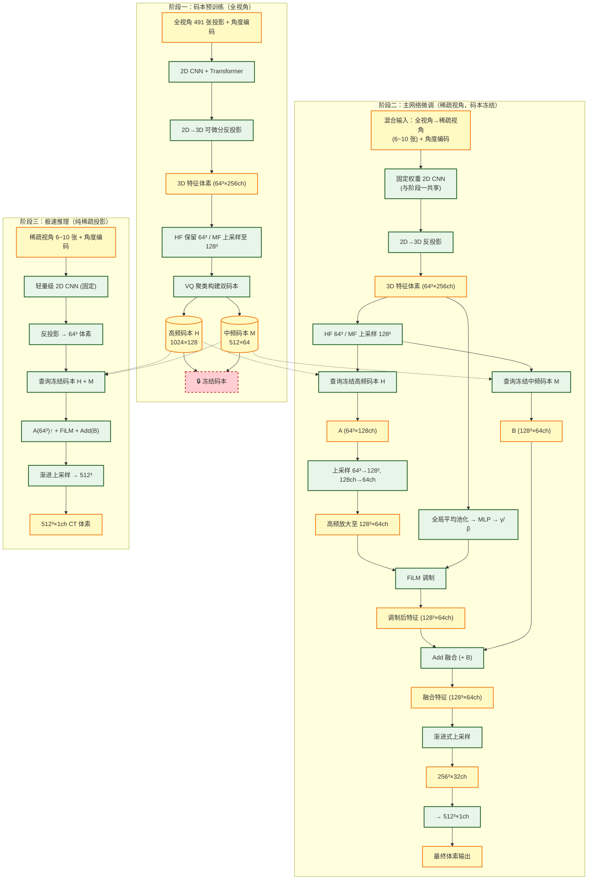

# SparseViewReconstruction 模型文档

基于双码本先验 + FiLM 骨架调制 + 渐进式 Mask 课程学习的稀疏 CBCT 重建。

**核心目标**：从 6~10 张稀疏 X 射线投影重建 CT 体素——**解剖结构和 HU 值分布均对齐 pCT**。

----

## 整体架构概览


```mermaid
graph TD
    classDef pretrain fill:#e1f5fe,stroke:#01579b,stroke-width:2px;
    classDef finetune fill:#f3e5f5,stroke:#4a148c,stroke-width:2px;
    classDef infer fill:#fff3e0,stroke:#e65100,stroke-width:2px;
    classDef module fill:#e8f5e9,stroke:#1b5e20,stroke-width:2px;
    classDef data fill:#fff9c4,stroke:#f57f17,stroke-width:2px;
    classDef frozen fill:#ffcdd2,stroke:#c62828,stroke-width:2px,stroke-dasharray: 5 5;

    subgraph Stage1 [阶段一：码本预训练（全视角）]
        direction TB
        P1["全视角 491 张投影 + 角度编码"]:::data --> P2["2D CNN + Transformer"]:::module
        P2 --> P3["2D→3D 可微分反投影"]:::module
        P3 --> P4["3D 特征体素 (64³×256ch)"]:::data
        P4 --> P5["HF 保留 64³ / MF 上采样至 128³"]:::module
        P5 --> P6["VQ 聚类构建双码本"]:::module
        P6 --> P7[("高频码本 H<br>1024×128")]:::data
        P6 --> P8[("中频码本 M<br>512×64")]:::data
        P7 --> P9["🔒 冻结码本"]:::frozen
        P8 --> P9
    end

    subgraph Stage2 [阶段二：主网络微调（稀疏视角，码本冻结）]
        direction TB
        F1["混合输入：全视角→稀疏视角<br>(6~10 张) + 角度编码"]:::data --> F2["固定权重 2D CNN<br>(与阶段一共享)"]:::module
        F2 --> F3["2D→3D 反投影"]:::module
        F3 --> F4["3D 特征体素 (64³×256ch)"]:::data
        F4 --> F5["HF 64³ / MF 上采样 128³"]:::module

        F5 --> F6["查询冻结高频码本 H"]:::module
        P7 -.-> F6
        F6 --> F7["A (64³×128ch)"]:::data

        F5 --> F8["查询冻结中频码本 M"]:::module
        P8 -.-> F8
        F8 --> F9["B (128³×64ch)"]:::data

        F7 --> F10["上采样 64³→128³, 128ch→64ch"]:::module
        F10 --> F11["高频放大至 128³×64ch"]:::data

        F4 --> F12["全局平均池化 → MLP → γ/β"]:::module
        F11 --> F14["FiLM 调制"]:::module
        F12 --> F14
        F14 --> F15["调制后特征 (128³×64ch)"]:::data

        F15 --> F16["Add 融合 (+ B)"]:::module
        F9 --> F16
        F16 --> F17["融合特征 (128³×64ch)"]:::data

        F17 --> F18["渐进式上采样"]:::module
        F18 --> F19["256³×32ch"]:::data
        F19 --> F20["→ 512³×1ch"]:::module
        F20 --> F21["最终体素输出"]:::data
    end

    subgraph Stage3 [阶段三：极速推理（纯稀疏投影）]
        direction TB
        I1["稀疏视角 6~10 张 + 角度编码"]:::data --> I2["轻量级 2D CNN (固定)"]:::module
        I2 --> I3["反投影 → 64³ 体素"]:::module
        I3 --> I4["查询冻结码本 H + M"]:::module
        P7 -.-> I4
        P8 -.-> I4
        I4 --> I5["A(64³)↑ + FiLM + Add(B)"]:::module
        I5 --> I6["渐进上采样 → 512³"]:::module
        I6 --> I7["512³×1ch CT 体素"]:::data
    end
```

### 三阶段总览

| 阶段 | 输入视角 | 码本状态 | 编码器状态 | 训练目标 |
|------|---------|---------|-----------|---------|
| 阶段一 (epoch 1~N₁) | 全视角 (491) | **可学习** | 可学习 | 构建高质量解剖码本 |
| 阶段二 (epoch N₁+1~N) | 渐进 Mask: 全→稀疏 (6) | **🔒冻结** | 可学习 | 适应稀疏输入，微调解码器 |
| 阶段三 (推理) | 稀疏 (6~10) | **🔒冻结** | **🔒冻结** | 纯前向快速重建 |

----

## 损失函数

三个损失各司其职，精确控制输出的解剖结构和 HU 值分布：

```python
L_total = 1.0 × L_lap  +  0.3 × L_struct  +  0.1 × L_vq
```

### 1. L_lap — 拉普拉斯金字塔损失（权重 1.0，主导）

| 项目 | 说明 |
|------|------|
| **公式** | `Σᵢ ‖Pred_levelᵢ − pCT_levelᵢ‖₁` |
| **比对对象** | **pCT**（规划 CT） |
| **作用维度** | 🎨 **HU 值分布风格** |
| **机制** | 将 pred 和 pCT 分别做拉普拉斯金字塔分解（levels=2），逐级计算 L1 |

```
拉普拉斯金字塔:
  Level 0 (高频细节): residual = img − upsample(downsample(img))
                       ↓ 捕获纹理、边缘的 HU 精度
  Level 1 (中频骨架): downsample(img)
                       ↓ 捕获整体亮度、窗宽窗位、组织对比度
```

> **为什么用拉普拉斯金字塔而不是直接 L2？** 直接 L2 会把高频细节和低频骨架混在一起模糊掉。金字塔分解后 HF 比 HF、MF 比 MF，形成**闭环频域监督**，确保解码器输出的高频码本特征和 pCT 的高频分量对齐。

### 2. L_struct — 结构损失（权重 0.3，辅助）

| 项目 | 说明 |
|------|------|
| **公式** | `‖∇Pred − ∇CT‖₁`（三方向梯度 L1 差） |
| **比对对象** | **CT**（规划 CT） |
| **作用维度** | 🦴 **解剖结构 / 边缘形状** |
| **机制** | 只比较空间梯度，不比较绝对 HU 值 |

```
梯度计算:  ∂Pred/∂x − ∂CT/∂x  (同理 ∂y, ∂z)
          ↓ 只看变化量，不看绝对值
CT 优势: 器官边界清晰，HU 值精准
```

> **为什么对 CT 只算梯度？** 梯度 L1 只关心"边界在哪里"，结合 L_lap 的 HU 值监督，形成互补：L_lap 负责"边界处的 HU 值是多少"，L_struct 负责"边界位置对不对"。

### 3. L_vq — 码本损失（权重 0.1，正则）

| 项目 | 说明 |
|------|------|
| **公式** | `‖sg[Q]−C‖² + 0.25×‖Q−sg[C]‖²` |
| **作用** | 📚 码本学习，确保解剖原语被充分利用 |
| **说明** | 双码本各有一个 VQ 损失，最终求和 |

```
sg[·] = stop_gradient（阻止梯度回传）

码本损失:   让码本向量 C 靠近编码器输出 Q（更新码本）
承诺损失:   让编码器输出 Q 靠近码本向量 C（更新编码器）
           ×0.25 平衡两者更新速度
```

---

## 损失-目标对照表

| 你想要的效果 | 用什么损失 | 和谁比 | 为什么不和其他比 |
|-------------|-----------|--------|-----------------|
| 🦴 器官形状 = CT | `L_struct` (梯度 L1) | CT | 梯度 L1 只关心边缘位置，和 L_lap 互补 |
| 🎨 HU 值 = CT | `L_lap` (金字塔 L1) | CT | 频域分解后 HF/HF、MF/MF 逐级对齐，精准控制 HU |
| 📚 码本利用充分 | `L_vq` | 自身 | 防止码本坍缩（死神经元） |

---

## 关键设计决策

| 决策 | 原因 |
|------|------|
| **阶段一冻结码本** | 码本存储通用解剖先验，后续不应被稀疏视角的残缺特征污染 |
| **HF 64³ / MF 128³** | HF 小尺寸存细节纹理，MF 大尺寸存器官轮廓骨架 |
| **L_lap + L_struct 都用 CT** | 不再使用 CBCT，CT 同时提供精准 HU 和清晰边缘，双损失互补 |
| **先上采样再 FiLM** | 避免特征维度错位导致的伪影 |
| **Add 融合而非 Concat** | 通道数不翻倍，显存减半 |
| **渐进式 Mask（非切换）** | 网络从 Day1 就在学"补全"，避免 Catastrophic Forgetting |
| **3D 全局池化 → FiLM 条件** | 用整体风格向量调制局部特征，比逐像素调制更鲁棒 |

---

## 关键超参数

| 参数 | 值 | 说明 |
|------|-----|------|
| `stage1_epochs` | 100 | 阶段一（码本预训练）持续 epoch 数 |
| `stage1_views` | 64 | 阶段一每 batch 最多视角数（随机采样，多 epoch 覆盖全视角） |
| `train_views` / `max_views` | 6 / 48 | 阶段二视角范围 |
| `target_keep` | 0.012 | 阶段二最终保留比例 (~6/491) |
| `n_decoder_ups` | 1→256³, 2→512³ | 解码器上采样次数 |
| `w_lap` / `w_struct` / `w_vq` | 1.0 / 0.3 / 0.1 | 损失权重 |
| LR | 1e-4 | AdamW + CosineAnnealing |
| Batch Size | 1 | 3D 模型显存限制 |
| AMP | True | fp16 混合精度 |

---

## 文件结构

```
LightningRecon/
├── src/
│   ├── models.py      # MultiScaleCNN2D, ViewTransformer, BackProjection3D,
│   │                    Codebook(HF+MF), FiLMBlock3D, ProgressiveDecoder,
│   │                    SparseViewReconstruction (6.3M params)
│   ├── losses.py      # laplacian_pyramid_loss, structural_loss, ReconstructionLoss
│   ├── dataset.py     # ThoraxCTDataset (pickle投影+CT体素)
│   ├── train.py       # 三阶段训练 + 渐进Mask + AMP + checkpoint
│   └── inference.py   # 端到端推理
├── ~/autodl-tmp/thorax/   # 数据源 (projections/*.pickle + images/ct/*.nii.gz)
├── logs/              # 训练日志 + TensorBoard + checkpoint
└── mymodel.md         # 本文档
```

### 命令

```bash
# ═══════════════════════════════════════════════════════════════════════
# 完整训练 (阶段一 + 阶段二，一条命令跑到底)
#
#   阶段一 (epoch 1~100): 全视角 (~490张) 预训练码本 + 编码器 + 解码器
#     每 batch 随机采样 --stage1_views 张，靠多 epoch 覆盖全部视角
#   阶段二 (epoch 101~400): 冻结码本，视角渐进 24→6，微调解码器
#
#   参数分工:
#     --stage1_epochs 100    ← 阶段一持续 epoch 数
#     --stage1_views 64      ← 阶段一每 batch 视角数 (数据集只加载这么多, 随机采样, 省内存)
#     --max_views 24         ← 阶段二视角递减起点 (从已加载的 stage1_views 中再子采样)
#     --n_decoder_ups 1      ← 模型输出分辨率 (1=256³, 2=512³)
# ═══════════════════════════════════════════════════════════════════════
# 输出 256³, 推荐 RTX 4090 24GB / A5000
python src/train.py --data_root ~/autodl-tmp/thorax --epochs 400 \
    --vol_size 128 128 128 --stage1_epochs 100 --stage1_views 64 \
    --n_decoder_ups 1 --max_views 24 --batch_size 1 --num_workers 2

# 输出 512³, 需 ≥24GB 显存，如 A6000 / H100
python src/train.py --data_root ~/autodl-tmp/thorax --epochs 400 \
    --vol_size 128 128 128 --stage1_epochs 100 --stage1_views 64 \
    --n_decoder_ups 2 --max_views 48 --batch_size 1 --num_workers 2

# 仅跑阶段一 (epochs == stage1_epochs，验证码本是否正常收敛)
python src/train.py --data_root ~/autodl-tmp/thorax --epochs 10 \
    --vol_size 128 128 128 --stage1_epochs 10 --stage1_views 64 \
    --n_decoder_ups 1 --max_views 24 --batch_size 1 --num_workers 2

# 推理
python src/inference.py \
    --checkpoint logs/thorax_6view_256/best_model.pth \
    --data_root ~/autodl-tmp/thorax --case_id CASE_ID --n_views 6

# TensorBoard
tensorboard --logdir logs/
```

### 已修复的已知问题（2026-07-21）

> **1. CUDA index out of bounds（训练首步崩溃）**
>
> **根因**: 训练循环原先假定所有样本都有 491 张投影，但真实数据集中部分病例只有 316~490 张。
> `torch.index_select` 传入超出实际视图数的索引时触发 CUDA device-side assert。
>
> **修复**: 在 `src/train.py` 中新增 `subsample_projections()` 函数，改为从当前张量的实际维度
> (`projs.shape[1]`) 读取视图数再采样，不再依赖硬编码的 491。
>
> **2. 码本坍缩 — PSNR 停滞在 13dB 且 VQ loss 归零**
>
> **根因**: 阶段一（码本预训练）本应使用全部投影，但 `max_views` 参数被错误地同时作用到
> 了阶段一，导致阶段一只用到了 24 张投影而非全部 491 张。码本因信息不足坍缩为 trivial solution。
>
> **修复**: 阶段一的 `n_keep` 改为 `V_total`（数据集实际最大投影数），不再被 `max_views` 截断。
>
> **3. 硬编码 V_total=491 — 无法适配不同投影数的数据集**
>
> **根因**: 训练脚本和数据集构造函数中硬编码了 `n_views=491` 和 `V_total=491`，
> 无法适配投影数不统一或非 491 张的数据集。
>
> **修复**:
> - `dataset.py`: `n_views` 默认值改为 `-1`（按需加载全部可用投影），同时预扫描所有病例的投影数范围
> - `train.py`: `V_total` 从 `ts.max_views` / `vs.max_views` 动态读取，不再写死 491

### 调试参数

如果训练首步仍报 CUDA 错误，可以加入以下调试标志定位问题：

```bash
CUDA_LAUNCH_BLOCKING=1 PYTHONFAULTHANDLER=1 \
python src/train.py --data_root ~/autodl-tmp/thorax --epochs 1 \
    --vol_size 128 128 128 --stage1_epochs 1 --n_decoder_ups 1 \
    --max_views 24 --batch_size 1 --num_workers 0 --eval_every 999
```

| 调试参数 | 作用 |
|----------|------|
| `CUDA_LAUNCH_BLOCKING=1` | 将异步 CUDA 调用变为同步，使错误栈精确指向出错的 Python 行 |
| `PYTHONFAULTHANDLER=1` | 捕获 Segmentation Fault 等底层崩溃并打印 Python 调用栈 |
| `--num_workers 0` | 禁用 DataLoader 多进程，排除 IPC 干扰 |
| `--epochs 1 --stage1_epochs 1` | 单 epoch 快速验证，跳过完整训练 |
| `--eval_every 999` | 跳过验证集评估，加速调试循环 |```

