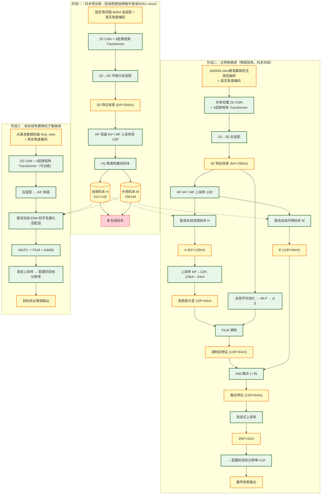

# SparseViewReconstruction 模型文档

基于双码本先验 + FiLM 骨架调制 + 视角课程学习的稀疏 CBCT 重建。

**核心目标**：从 6~10 张稀疏 X 射线投影重建 CT 体素——**解剖结构和 HU 值分布均对齐 pCT**。

----

## 整体架构概览


```mermaid
graph TD
    classDef pretrain fill:#e1f5fe,stroke:#01579b,stroke-width:2px;
    classDef finetune fill:#f3e5f5,stroke:#4a148c,stroke-width:2px;
    classDef infer fill:#fff3e0,stroke:#e65100,stroke-width:2px;
    classDef module fill:#e8f5e9,stroke:#1b5e20,stroke-width:2px;
    classDef data fill:#fff9c4,stroke:#f57f17,stroke-width:2px;
    classDef frozen fill:#ffcdd2,stroke:#c62828,stroke-width:2px,stroke-dasharray: 5 5;

    subgraph Stage1 [阶段一：码本预训练（各病例原始网格中直采60/64 views）]
        direction TB
        P1["固定等间隔 60/64 张投影 + 真实角度编码"]:::data --> P2["2D CNN + 4层跨视角 Transformer"]:::module
        P2 --> P3["2D→3D 可微分反投影"]:::module
        P3 --> P4["3D 特征体素 (64³×256ch)"]:::data
        P4 --> P5["HF 保留 64³ / MF 上采样至 128³"]:::module
        P5 --> P6["VQ 聚类构建双码本"]:::module
        P6 --> P7[("高频码本 H<br>512×128")]:::data
        P6 --> P8[("中频码本 M<br>256×64")]:::data
        P7 --> P9["🔒 冻结码本"]:::frozen
        P8 --> P9
    end

    subgraph Stage2 [阶段二：主网络微调（稀疏视角，码本冻结）]
        direction TB
        F1["从60/64-view基准集随机无放回抽样<br>+ 真实角度编码"]:::data --> F2["共享权重 2D CNN<br>+ 4层跨视角 Transformer"]:::module
        F2 --> F3["2D→3D 反投影"]:::module
        F3 --> F4["3D 特征体素 (64³×256ch)"]:::data
        F4 --> F5["HF 64³ / MF 上采样 128³"]:::module

        F5 --> F6["查询冻结高频码本 H"]:::module
        P7 -.-> F6
        F6 --> F7["A (64³×128ch)"]:::data

        F5 --> F8["查询冻结中频码本 M"]:::module
        P8 -.-> F8
        F8 --> F9["B (128³×64ch)"]:::data

        F7 --> F10["上采样 64³→128³, 128ch→64ch"]:::module
        F10 --> F11["高频放大至 128³×64ch"]:::data

        F4 --> F12["全局平均池化 → MLP → γ/β"]:::module
        F11 --> F14["FiLM 调制"]:::module
        F12 --> F14
        F14 --> F15["调制后特征 (128³×64ch)"]:::data

        F15 --> F16["Add 融合 (+ B)"]:::module
        F9 --> F16
        F16 --> F17["融合特征 (128³×64ch)"]:::data

        F17 --> F18["渐进式上采样"]:::module
        F18 --> F19["256³×32ch"]:::data
        F19 --> F20["→ 配置的目标分辨率×1ch"]:::module
        F20 --> F21["最终体素输出"]:::data
    end

    subgraph Stage3 [阶段三：目标视角数随机子集微调]
        direction TB
        I1["从基准集随机抽 final_view<br>+ 真实角度编码"]:::data --> I2["2D CNN + 4层跨视角 Transformer（可训练）"]:::module
        I2 --> I3["反投影 → 64³ 体素"]:::module
        I3 --> I4["查询冻结 EMA 码字及量化适配层"]:::module
        P7 -.-> I4
        P8 -.-> I4
        I4 --> I5["A(64³)↑ + FiLM + Add(B)"]:::module
        I5 --> I6["渐进上采样 → 配置的目标分辨率"]:::module
        I6 --> I7["目标协议微调输出"]:::data
    end
```

### Transformer 配置

模型只实例化一个共享的 `ViewTransformer`，在三个训练阶段复用同一组参数。
该模块内部堆叠 **4 个 `TransformerEncoderLayer`**，每层使用 4 个注意力头，
特征维度为 256，前馈层维度为 1024。注意力沿视角维度计算；进入
Transformer 前，二维特征会自适应池化到 `8×8`，输出恢复空间尺寸后与
CNN 特征做残差相加。

### 三阶段总览

| 阶段 | Epoch | 视角 | 码本 | LR | 说明 |
|------|-------|------|------|-----|------|
| 阶段一 | 前200轮 | 60或64 | 🔓 EMA 更新 | encoder=1e-4 | 构建解剖码本 |
| 阶段二 | 每级40轮 | 从最高视角基准集随机抽取课程指定数量 | 🔒 EMA 码字冻结 | encoder=5e-5 | 多角度子集稀疏适应 |
| 阶段三 | 最后100轮 | 从同一基准集随机抽取`final_view` | 🔒 EMA及量化适配层冻结 | encoder=1e-5, decoder=2e-5 | 目标视角数微调 |

**视角课程**：由 `--final_view` 选择内置确定性映射：

| `final_view` | 阶段一及阶段二课程（高→低） | 阶段三 |
|---|---|---|
| 6 | 60→54→48→36→24→12→6 | 从60中随机抽6 |
| 8 | 64→56→48→32→24→16→8 | 从64中随机抽8 |
| 10 | 60→50→40→30→20→10 | 从60中随机抽10 |

默认总计：6/8-view为 **540 epochs**，10-view为 **500 epochs**。

可用 `--view_schedule` 提供完整高到低序列覆盖内置映射；最高视角数必须能
被 `final_view` 整除，以便定义固定、可复现的验证和厂家部署子集。

对每个病例，先读取其实际原始视角数 `V_case`（可以是491、464或其他值），
数据集以 `--source_views -1` 加载该病例的全部投影。首先按
`base[j] = floor(j×V_case/B)` 均匀建立最高视角基准集，其中 6/10-view
任务的 `B=60`，8-view 任务的 `B=64`。阶段一完整使用这个有序基准集；
阶段二和阶段三每个训练 batch 都从基准集随机无放回抽取当前要求的视角数，
然后按原始采集顺序排序，投影与真实角度始终成对。

验证、测试和推理不随机：它们从基准集按
`floor(k×B/final_view)` 选取固定厂家子集。因此同一 checkpoint 的指标完全
可重复，而训练可以见到更多基准角度组合。不同病例只要求实际视角数不少于
课程最大视角数，不要求原始总数一致。变长全视角数据在 batch 中保持为列表，
抽成相同视角数后才堆叠，不做补零填充。训练集用于更新参数，验证集按照
逐病例平均的完整体积 PSNR 选择 best checkpoint，测试集只在训练结束后对
best checkpoint 评估一次。验证与测试只输出完整体积 PSNR、SSIM 和损失指标。

----

## 损失函数（Charbonnier 主导）

损失函数从三部分改为四部分，**L_img (Charbonnier) 为主损失**：

```python
L_total = w_img·L_img + w_lap·L_lap + w_struct·L_struct + w_vq·L_vq
```

| 阶段 | w_img | w_lap | w_struct | w_vq | 说明 |
|------|-------|-------|----------|------|------|
| 阶段一 (60/64 views) | **1.0** | 0.05 | 0.05 | 0.05 | EMA码字学习，L_img 主导 |
| 阶段二 (内置课程→目标) | **1.0** | 0.04 | 0.08 | 0.02 | EMA码字冻结，稀疏适应 |
| 阶段三 (目标视角) | **1.0** | 0.02 | 0.05 | 0 | 量化模块冻结，编码器/解码器微调 |

### 1. L_img — Charbonnier 图像损失（权重 1.0，**主导**）

| 项目 | 说明 |
|------|------|
| **公式** | `√((pred−ct)² + ε²)`, ε=1e-3 |
| **计算区域** | **完整 CT 体积** |
| **作用** | 优化完整体积 HU 值精度，L1 平滑版本梯度更稳定 |

### 2. L_lap — 拉普拉斯金字塔损失（权重 0.02~0.05，辅助）

金字塔分解后逐级 L1 对齐，形成闭环频域监督。

### 3. L_struct — 结构损失（权重 0.05~0.08，辅助）

逐体素比较三个方向的一阶梯度 L1，对齐解剖边缘的位置和幅度。阶段一
使用 0.05，阶段二稀疏适应提高到 0.08；若启用阶段三，最终微调回落到
0.05，避免过度锐化稀疏视角条纹。若 `--stage3_epochs 0`，两阶段训练的
最终阶段保持 0.08。

### 4. L_vq — 码本损失（权重 0~0.05，正则）

验证指标逐病例调用 `skimage.metrics.structural_similarity` 计算完整
3D 体数据 SSIM，不拆分 2D axial slice；使用 Gaussian 权重、
`sigma=1.5`、`win_size=11`、`data_range=1.0`、
`use_sample_covariance=False`、`channel_axis=None`（即 `11×11×11`
三维窗口），然后对病例平均。TensorBoard 还分别记录 HF/MF 码本的 perplexity、
normalized perplexity（`perplexity / 码字数`）、batch/EMA active fraction、
active/dead codes、dead-code 单次及累计重初始化数，以及各加权损失对总损失的
贡献比例。

---

## 关键设计决策

| 决策 | 原因 |
|------|------|
| **阶段二开始冻结EMA码字** | 码本存储通用解剖先验，后续不应被稀疏视角的残缺特征污染 |
| **跨病例 K-means 初始化** | 阶段一从前 8 个打乱的训练 batch 分批收集固定总量的均匀特征，再统一聚类，降低首个病例偏置 |
| **dead-code 重初始化** | 仅在阶段一 EMA 可更新时定期把长期未使用码字替换成当前均匀抽样特征；阶段二、三冻结后不再执行 |
| **第一轮保持均匀特征采样** | 不依赖外部区域标注；先观察前 50 轮利用率，再决定是否加入结构感知混合采样 |
| **HF 64³ / MF 128³** | HF 小尺寸存细节纹理，MF 大尺寸存器官轮廓骨架 |
| **L_lap + L_struct 都用 CT** | 不再使用 CBCT，CT 同时提供精准 HU 和清晰边缘，双损失互补 |
| **先上采样再 FiLM** | 避免特征维度错位导致的伪影 |
| **Add 融合而非 Concat** | 通道数不翻倍，显存减半 |
| **3D 全局池化 → FiLM 条件** | 用整体风格向量调制局部特征，比逐像素调制更鲁棒 |
| **EMA 码本（非梯度码本）** | 梯度码本易坍缩 (SSIM≈0)；EMA 指数移动平均更新码字，避免死神经元 |
| **分块距离计算** | 128³ 体积 × 256 码字仍会产生约 2GB 距离矩阵 → 自动分块 (≤256MB/块)，避免 OOM |

---

## 码本实现：EMA Vector Quantizer

### 为什么不用梯度码本？

原始梯度码本 (`query_codebook_3d`) 使用直通估计器 (STE) 回传梯度：
- **问题**：梯度码本无法保证码字被充分使用 → **码本坍缩**（SSIM≈0，perplexity≈1）
- **表现**：训练 60+ 轮 SSIM 始终为 0，所有编码器输出映射到 1-2 个码字

### EMA 码本原理

```python
# 核心：EMA 更新替代梯度更新
class EmbeddingEMA:
    cluster_size_ema = decay * cluster_size + (1-decay) * sum(one_hot)
    embed_avg_ema    = decay * embed_avg    + (1-decay) * embed_sum
    
    # 拉普拉斯平滑避免除零
    weight = embed_avg_normalized / (cluster_size_smoothed)
    
    # 关键：未使用的码字保持原值（不除以 eps）
    weight[cluster_size == 0] = weight_original
```

| 参数 | 值 | 说明 |
|------|-----|------|
| `decay` | 0.99 | EMA 衰减速率为 0.99，稳定更新 |
| `beta` | 0.25 | commitment loss 权重 |
| `eps` | 1e-5 | 拉普拉斯平滑系数 |
| `kmeans_iters` | 10 | Lloyd K-means 迭代数 |
| `kmeans_samples_per_code` | 4 | 每个码字均匀抽取 4 个当前特征作为初始化样本上限 |
| `kmeans_init_batches` | 8 | 将初始化样本预算均匀分散到前 8 个训练 batch |
| `dead_code_threshold` | 0.1 | EMA cluster size 低于此值视为 dead code |
| `dead_code_check_interval` | 100 | 每 100 个 EMA 更新 forward 检查一次 |
| `dead_code_warmup_steps` | 100 | 前 100 个 EMA 更新 forward 不做 dead-code 重置 |
| 距离精度 | fp32 | 强制 float32 计算距离，防止 AMP fp16 溢出 NaN |

初始化特征池、已收集数量、batch进度、初始化状态、EMA更新步数和dead-code
累计重置数都是模型buffer，会随checkpoint保存和恢复。正式第1轮优化开始前，
程序保持网络权重不变，以无梯度预扫描方式读取8个打乱的训练batch；前7个
batch只收集特征，第8个batch收集完成后执行一次K-means，随后才建立优化器并
进入训练。验证、推理和断点续训不会重复初始化。空聚类的EMA计数保持为0，
不会再被提前统计成active。初始化与dead-code替换均为普通均匀特征抽样，
不读取外部区域标注，也没有启用结构感知偏置。

### 分块计算：避免 O(N×K) 矩阵 OOM

```
问题：einsum('bd,nd->bn', z, w) 产生的距离矩阵：
  HF 码本：64³ × 512 = 262K × 512 = 0.5 GB
  MF 码本：128³ × 256 = 2.1M × 256 = 2.1 GB  ← 仍可能 OOM

解决：自适应分块
  chunk_size = 256MB / (num_tokens × 4)
  → 将 z 分成多个 chunk，逐块计算 argmin 和 scatter_add
  → 数学等价，峰值内存从 4.3GB 降到 256MB
```

双码本配置：

| 码本 | 体积 | 通道 | 码字数 | 分块数 | 峰值显存 | 用途 |
|------|------|------|--------|--------|----------|------|
| HF | 64³ | 128 | 512 | ~2 | 256 MB | 高频细节纹理 |
| MF | 128³ | 64 | 256 | ~8 | 256 MB | 中频器官轮廓 |

### 前 50 轮利用率观察

当前版本不自动切换到结构感知采样。训练前 50 轮会逐轮在控制台打印并在
TensorBoard 的 `Codebook/` 下记录 HF/MF 的 `ema_active_fraction` 和
`normalized_perplexity`，第 50 轮还会生成 `Codebook/Epoch50Review` 文本摘要。
建议同时查看最后 10 轮趋势，而不是只看第 50 轮单点：如果某一级码本的
batch/EMA active fraction 长期低于约 20%，且 normalized perplexity 长期低于
约 10%，再在下一版启用结构感知混合采样。dead-code 刚重置的码字不会被提前
计作 active，必须再次被真实特征选中后才算活跃。

---

## 关键超参数

### 训练调度

| 参数 | 默认值 | 说明 |
|------|--------|------|
| `--stage1_epochs` | 200 | 阶段一最高视角预训练轮数 |
| `--final_view` | 6 | 最终训练、验证和推理视角；可选6/8/10 |
| `--view_schedule` | 空 | 可选完整覆盖序列，如`"60,48,36,24,12,6"` |
| `--run_version` | 必填 | 唯一运行版本，如`v7`；已有非空版本目录不会被覆盖 |
| `--source_views` | -1 | 加载每个病例的全部视角并自适应；正整数仅作为所有病例原始视角数一致的可选断言 |
| `--resume` | 空 | 从 best、periodic 或 last checkpoint 完整恢复 |
| `--stage2_epochs_per_view` | 40 | 阶段二每个视角级训练轮数 |
| `--stage3_epochs` | 100 | 阶段三目标视角微调轮数 |

### 模型

| 参数 | 默认值 | 说明 |
|------|--------|------|
| `--vol_size` | 128 128 128 | CT 标签体素尺寸；必须与解码器输出尺寸一致 |
| `--proj_size` | 128 128 | 投影图 resize 尺寸 |
| `--transformer_layers` | 4 | 跨视角 `TransformerEncoderLayer` 堆叠数；写入 checkpoint 并由推理读取 |
| `--hf_codebook_size` | 512 | HF 码字数 |
| `--mf_codebook_size` | 256 | MF 码字数 |
| `--kmeans_iters` | 10 | 首次 K-means 初始化迭代数 |
| `--kmeans_samples_per_code` | 4 | K-means 均匀特征样本数倍率 |
| `--kmeans_init_batches` | 8 | K-means初始化跨越的打乱训练batch数 |
| `--dead_code_threshold` | 0.1 | dead code 的 EMA cluster-size 阈值 |
| `--dead_code_check_interval` | 100 | dead-code 检查间隔（EMA forward 次数） |
| `--dead_code_warmup_steps` | 100 | dead-code 检查预热（EMA forward 次数） |
| `--n_decoder_ups` | 1 | 解码器上采样次数（0=128³、1=256³、2=512³；2 需 >24GB） |

`--vol_size` 控制数据集生成的 CT 标签尺寸，`--n_decoder_ups` 控制模型输出尺寸。
二者必须使用以下确定性对应关系，避免训练时将已经缩放过的 CT 标签再次插值：
当前两个参数的命令行默认值分别为 `128 128 128` 和 `1`，属于历史默认组合，
因此正式训练时不要同时省略它们，必须按下表显式传入。

| 目标重建尺寸 | `--vol_size` | `--n_decoder_ups` |
|---|---|---:|
| 128³ | `128 128 128` | 0 |
| 256³（推荐） | `256 256 256` | 1 |
| 512³（4090D 不推荐） | `512 512 512` | 2 |

例如，训练真正的 256³ 输出时必须同时写为：

```bash
--vol_size 256 256 256 \
--n_decoder_ups 1
```

不要组合 `--vol_size 256 256 256 --n_decoder_ups 0`，因为它会产生 256³
CT 标签和 128³ 模型输出，仍然需要插值才能计算损失。

### 优化

| 参数 | 默认值 | 说明 |
|------|--------|------|
| `--batch_size` | 1 | 3D 模型显存限制 |
| `--grad_accum` | 4 | 梯度累积（等效 batch=grad_accum，loss 已除以 accum） |
| `--amp` | True | fp16 混合精度 |
学习率由阶段策略自动设置，并分别记录 encoder、codebook 和 decoder。

### 损失权重（阶段内自动切换，无需手动设置）

| 阶段 | `w_img` | `w_lap` | `w_struct` | `w_vq` |
|------|---------|---------|------------|--------|
| 阶段一 | 1.0 | 0.05 | 0.05 | 0.05 |
| 阶段二 | 1.0 | 0.04 | 0.08 | 0.02 |
| 阶段三 | 1.0 | 0.02 | 0.05 | 0 |

### 训练命令

```bash
conda activate lightningrecon
cd /root/autodl-tmp/LightningRecon

# ═══════════════════════════════════════════════════════════════
# ① 完整训练 256³ (推荐, 6/8-view约540轮，10-view约500轮)
# ═══════════════════════════════════════════════════════════════
python src/train.py \
    --data_root /root/autodl-tmp/thorax \
    --vol_size 256 256 256 --proj_size 128 128 \
    --final_view 6 --source_views -1 --run_version v7 \
    --stage1_epochs 200 --stage2_epochs_per_view 40 \
    --stage3_epochs 100 \
    --n_decoder_ups 1 --grad_accum 8 --batch_size 1 --num_workers 2

# ═══════════════════════════════════════════════════════════════
# ② 完整训练 512³ (需 >24GB 显存, 4090D 不建议)
# ═══════════════════════════════════════════════════════════════
python src/train.py \
    --data_root /root/autodl-tmp/thorax \
    --vol_size 512 512 512 --proj_size 128 128 \
    --final_view 6 --source_views -1 --run_version v7 \
    --stage1_epochs 200 --stage2_epochs_per_view 40 \
    --stage3_epochs 100 \
    --n_decoder_ups 2 --grad_accum 8 --batch_size 1 --num_workers 2

# ═══════════════════════════════════════════════════════════════
# ③ 快速验证EMA学习及课程切换（6-view共16轮）
# ═══════════════════════════════════════════════════════════════
python src/train.py \
    --data_root /root/autodl-tmp/thorax \
    --vol_size 256 256 256 --proj_size 128 128 \
    --final_view 6 --source_views -1 --run_version v7 --stage1_epochs 10 \
    --stage2_epochs_per_view 1 --stage3_epochs 0 \
    --n_decoder_ups 1 --grad_accum 2 --batch_size 1 --num_workers 0

# ═══════════════════════════════════════════════════════════════
# ④ 快速端到端测试（6-view共8轮）
# ═══════════════════════════════════════════════════════════════
python src/train.py \
    --data_root /root/autodl-tmp/thorax \
    --vol_size 256 256 256 --proj_size 128 128 \
    --final_view 6 --source_views -1 --run_version v7 --stage1_epochs 1 \
    --stage2_epochs_per_view 1 \
    --stage3_epochs 1 \
    --n_decoder_ups 1 --grad_accum 2 --batch_size 1 --num_workers 0

# ═══════════════════════════════════════════════════════════════
# ⑤ 推理
# ═══════════════════════════════════════════════════════════════
python src/inference.py \
    --checkpoint 'logs/thorax_fast_finalview=6_256_v7/best_model_finalview=6_v7.pth' \
    --data_root /root/autodl-tmp/thorax --case_id CASE_ID \
    --final_view 6 --source_views -1

# TensorBoard
tensorboard --logdir 'logs/thorax_fast_finalview=6_256_v7/tensorboard'
```

训练程序会根据实际的 `--run_version` 构造运行目录，并在启动时打印本次
运行专用的 TensorBoard 命令。例如传入 `--run_version v7` 时，日志目录
为 `thorax_fast_finalview=6_256_v7/tensorboard`；后续传入 `v8` 时会自动
变为对应的 `_v8/tensorboard`，不需要手工修改训练代码。由于本次增加了可恢复
的跨batch K-means初始化状态并更新了checkpoint格式，不能从v6或更早的
checkpoint resume，必须使用新版本名开始训练。

当前版本只主动写入以下 TensorBoard 内容：

- `Run/Metadata`
- `Train/Loss/*` 与 `Train/LossContribution/*`
- `Codebook/hf_normalized_perplexity`、`Codebook/mf_normalized_perplexity`
- `Codebook/*_batch_active_fraction`、`Codebook/*_ema_active_fraction`
- `Codebook/*_dead_codes_reinitialized` 与累计重初始化数
- `Codebook/Epoch50Review`
- `Train/LearningRate/*`、`Train/n_views`、`Train/Stage`
- `Codebook/*`
- `Val/*` 与 `Test/*`

不会调用 `add_graph()`，因此不会写入 Transformer 内部计算图。每个新运行
必须使用新的 `--run_version`，非空运行目录会被拒绝；resume 会使用
`purge_step` 处理恢复点之后的重叠 step。旧版目录中多次启动产生的多个
event 文件仍会被 TensorBoard 合并展示，应与新版本运行目录分开查看。

### 基线对比

| 方法 | PSNR (dB) | SSIM | 说明 |
|------|-----------|------|------|
| CBCT vs CT | 17.69 ± 3.01 | 0.765 ± 0.214 | 训练集 (116 例) |
| CBCT vs CT | 17.93 ± 2.35 | 0.808 ± 0.137 | 测试集 (26 例) |
| 模型 (2 轮快速测试) | 20.76 | 0.473 | 仅 2 轮，SSIM 在快速增长中 |
| 模型 (5 轮) | - | - | 损失: 0.115→0.040, 码本损失: 0.017→0.004 |

---

## 文件结构

```
LightningRecon/
├── src/
│   ├── models.py        # MultiScaleCNN2D (动态尺寸), ViewTransformer,
│   │                      BackProjection3D, EMAVectorQuantizer3D (HF+MF),
│   │                      FiLMBlock3D, ProgressiveDecoder,
│   │                      SparseViewReconstruction (6.5M params)
│   ├── ema_codebook.py  # EMA 码本实现 (分块距离计算, scatter_add EMA 统计)
│   │                      - EmbeddingEMA: EMA 更新的 embedding
│   │                      - EMAVectorQuantizer: 单层 VQ (分块 argmin)
│   │                      - EMAVectorQuantizer3D: 3D 封装 (pre/post 1×1×1 conv)
│   ├── losses.py        # laplacian_pyramid_loss, structural_loss, ReconstructionLoss
│   ├── dataset.py       # ThoraxCTDataset (pickle投影+CT体素)
│   ├── train.py         # 三阶段训练脚本 (grad_accum, whole-volume PSNR, AMP)
│   └── inference.py     # 推理脚本
├── tests/
│   ├── test_dataset.py  # 数据集加载测试
│   └── baseline_psnr.py # CBCT vs CT 基线 PSNR/SSIM 计算
├── logs/                # 训练日志 + TensorBoard
│   └── thorax_fast_finalview=6_256_v7/
│       ├── best_model_finalview=6_v7.pth
│       ├── ckpt_0050_finalview=6_v7.pth
│       ├── config.json
│       └── tensorboard/
├── data/thorax_fast/    # 原始数据（投影 npy + 预处理脚本）
├── mymodel.md           # 本文档
├── mythinking.md        # 设计思路笔记
└── requirements.txt
```

